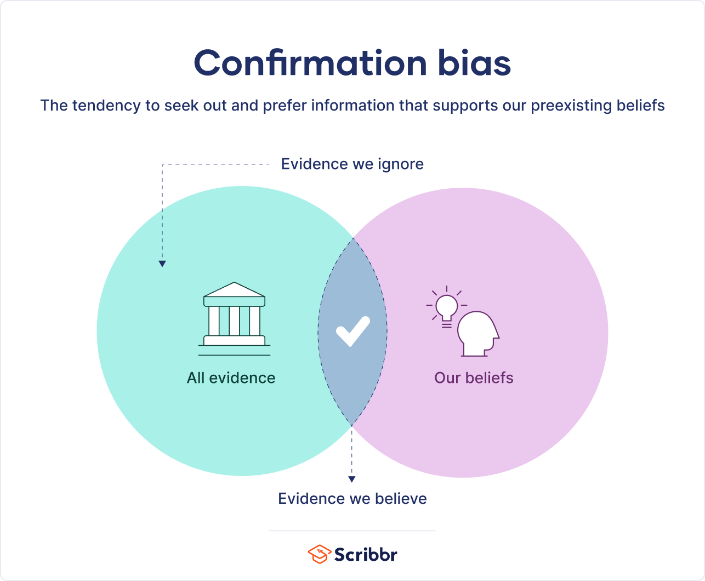
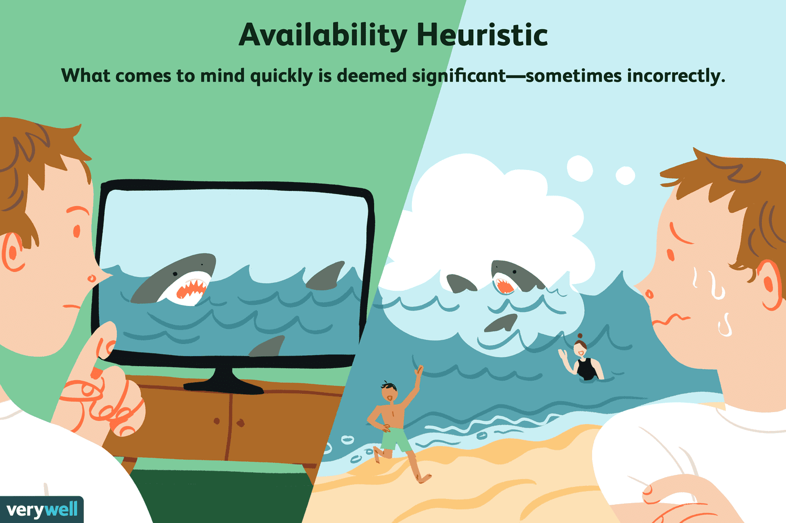
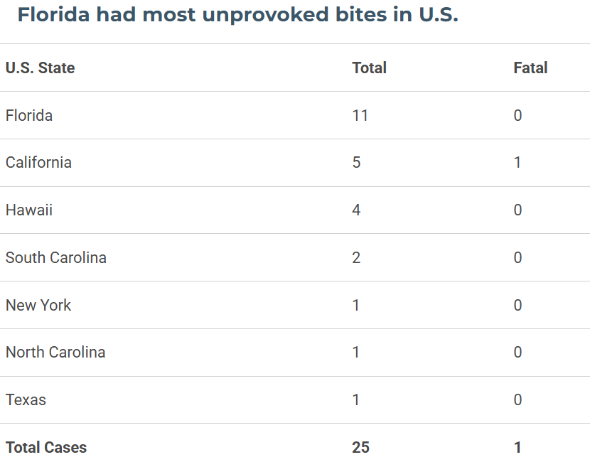

## Cognitive Biases & Heuristics {background-color="#f8fafc"}

:::: {.hero}
::: {.eyebrow}
Data analytics presentation
:::

# Cognitive Biases & Heuristics

::: {.hero-subtitle}
How anchoring, confirmation bias, and availability heuristic can shape analysis, decisions, and experiments.
:::

:::: {.hero-footer}
::: {.hero-name}
Anissa Chan
:::

::: {.hero-tag}
MGTA 495
:::
::::
::::

::: {.notes}
Everyone has some sort of bias. Whether that be preferring cheeseburgers over hotdogs or fantasy over sci-fi. It affects everything: who we hang out with, what we believe, how we interact with the world. Data is no different. In this presentation, I will focus on three common examples: anchoring effect, confirmation bias, and the availability heuristic.
:::

---

## Why this matters in analytics

:::: {.grid-3}
::: {.mini-card}
### Bias is normal
Bias affects how we interpret patterns, frame questions, and judge results.
:::

::: {.mini-card}
### Data is not immune
Even with data, analysts can still overweight certain evidence and miss better explanations.
:::

::: {.mini-card}
### Better process helps
Good experimental design, critical thinking, and deliberate review reduce the risk.
:::
::::

::: {.takeaway}
**Main idea:** the goal is not to eliminate human judgment, but to recognize where it can distort analysis.
:::

---

## Anchoring Effect

:::: {.columns}
::: {.column width="56%"}
::: {.concept-card}
### What is it?
Overreliance on the first piece of information seen.

### Why it matters in data analysis
- Early assumptions can shape later interpretation.
- Updated evidence may get discounted.
- Initial benchmarks can make later values feel misleadingly high or low.
:::

::: {.speaker-prompt}
**Example:** if someone first sees a car priced at 60k, then 30k feels like a bargain. If they first see 30k, it can feel expensive.
:::
:::

::: {.column width="44%"}
{fig-alt="Anchoring effect car pricing example" .feature-figure}
:::
::::

::: {.notes}
The anchoring effect is relying too heavily on the first piece of information offered. In analytics, this can happen when we anchor on an early metric, an initial forecast, or a first read of a dataset and then underreact to newer evidence.
:::

---

## Confirmation Bias

:::: {.columns}
::: {.column width="55%"}
::: {.concept-card}
### What is it?
The tendency to seek, interpret, and remember information that supports existing beliefs.

### Why it matters in data analysis
- Experiments may be designed to confirm what we already think.
- Conflicting results may get ignored or explained away.
- New ideas can be passed over before they are fully explored.
:::

::: {.speaker-prompt}
**Everyday example:** searching until you find the answer you wanted all along.
:::
:::

::: {.column width="45%"}
{fig-alt="Confirmation bias diagram" .feature-figure}

::: {.fragment}
{fig-alt="Blueberries photo" .feature-figure .feature-figure-small}
:::

::: {.fragment}
{fig-alt="Typing GIF" .feature-figure .feature-figure-small}
:::
:::
::::

::: {.notes}
Confirmation bias is the tendency to seek and interpret information in ways that confirm pre-existing beliefs. A simple example is searching online until you find a result that supports what you wanted to believe. In analytics, this can show up in both experiment design and interpretation.
:::

---

## Availability Heuristic

:::: {.columns}
::: {.column width="45%"}
{fig-alt="Availability heuristic illustration" .feature-figure}

::: {.fragment}
{fig-alt="Shark attack table" .feature-figure .feature-figure-small}
:::
:::

::: {.column width="55%"}
::: {.concept-card}
### What is it?
The tendency to rely on memorable or vivid examples when making judgments.

### Why it matters in data analysis
- Striking events can feel more common than they really are.
- Analysts may overemphasize dramatic findings.
- Less memorable but still important evidence can be overlooked.
:::

::: {.speaker-prompt}
**Example:** shark attacks feel common because they are memorable, even though actual incidents are rare.
:::
:::
::::

::: {.notes}
The availability heuristic causes us to lean on examples that are easy to recall. In practice, that often means surprising, emotional, or highly publicized events. In data work, this can push us toward the most memorable result rather than the most representative one.
:::

---

## How to reduce bias in practice

:::: {.grid-2}
::: {.action-card}
### Revisit first assumptions
Pause and ask whether the original benchmark still makes sense.
:::

::: {.action-card}
### Look for disconfirming evidence
Actively search for information that challenges your preferred explanation.
:::

::: {.action-card .fragment}
### Use stronger methods
Randomization, blind testing, and clear experimental design reduce bias.
:::

::: {.action-card .fragment}
### Review full context
Consider outliers, alternatives, and less memorable evidence before concluding.
:::
::::

::: {.takeaway}
**Conclusion:** biases and heuristics are part of everyday thinking, so stronger analysis depends on recognizing them and building guardrails against them.
:::

::: {.notes}
In conclusion, biases and heuristics are part of everyday thinking. As analysts and experimenters, we need to catch ourselves when they appear and use good process, like critical thinking, randomization, blind testing, and broader evidence review, to reduce their impact.
:::

---

## Sources

::: {.sources-grid}
- [Florida Museum: Yearly Worldwide Shark Attack Summary](https://www.floridamuseum.ufl.edu/shark-attacks/yearly-worldwide-summary/)
- [Harvard PON: Anchoring Effect](https://www.pon.harvard.edu/tag/anchoring-effect/)
- [Penn SAS: Cognitive Bias and Data](https://lpsonline.sas.upenn.edu/features/cognitive-bias-and-data-how-human-psychology-impacts-data-interpretation)
- [Oxford Review: Confirmation Bias](https://oxford-review.com/the-oxford-review-dei-diversity-equity-and-inclusion-dictionary/confirmation-bias-definition-and-explanation/)
:::
